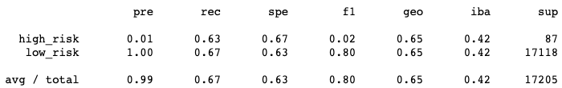
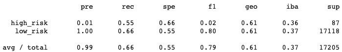
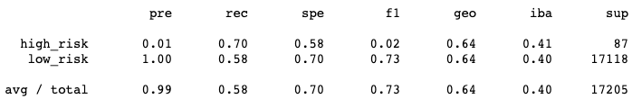
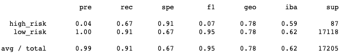
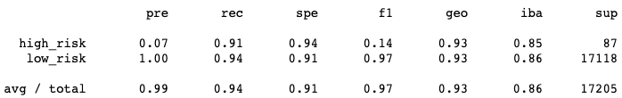

# 17Credit_Risk_Analysis

## Overview and Purpose
The purpose of this project was to use different types of linear regression models in order to predict/calculate the risk of a loan based on our given dataset.

## Results
Below you will find the accuracy score, precision, and recall of each machine learning model that was used for this project 

- RandomOverSampler

- SMOTE

- ClusterCentroids

- SMOTEENN

- BalancedRandomForestClassifier

- EasyEnsembleClassifier

