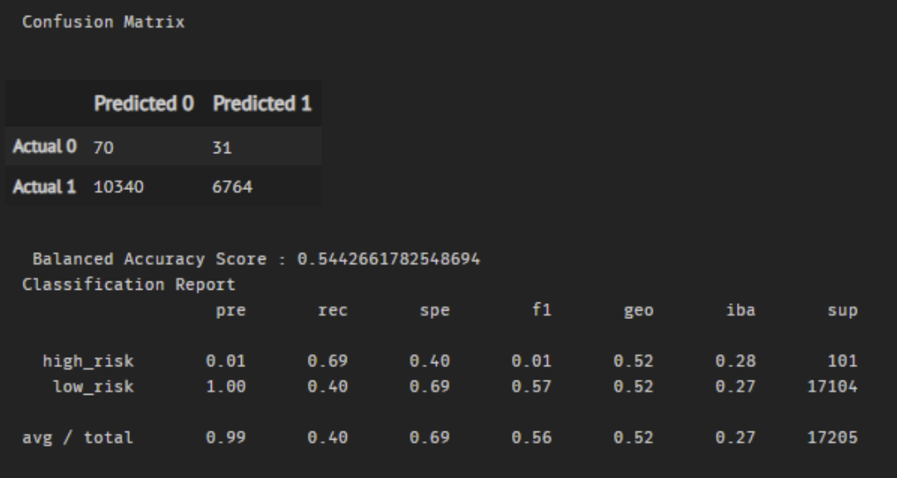

# Credit_Risk_Analysis
## Overview

In this project, we apply machine learning techniques to predict credit risk. The goal is to provide a quicker, more reliable loan process and more accurate identification of suitable candidates for loans, leading to low loan default rates. We will build several machine learning algorithms to predict credit risk. We would use techniques such as resampling to make the most of our dataset. Once we have designed and implemented these algorithms, we evaluate their performance and see how well the models predict data.

Using the credit card credit dataset from LendingClub, a peer-to-peer lending services company, we will oversample the data using the RandomOverSampler and SMOTE algorithms and undersample the data using the ClusterCentroids algorithm. Then, we will use a combinatorial approach of over-and undersampling using the SMOTEENN algorithm. Next, we will compare two new machine learning models that reduce bias, BalancedRandomForestClassifier, and EasyEnsembleClassifier, to predict credit risk. In the end, we will evaluate the performance of these models and recommend whether any of the models should be used to predict credit risk.

## Results
#### Logistic Regression with Different Sampling Methods
##### Balanced Accuracy Score
Since we have imbalanced classes, we use the Balanced Accuracy score to measure how well our Logistic Regression performs with the different sampling methods.
- Random Oversampling: For the Random Oversampling, our Balanced Accuracy Score is 0.65 meaning that the model was correct (in predicting high_risk and low_risk loans) 65% of the time.
- SMOTE Sampling: Balanced Accuracy Score for the SMOTE sampling method sligly ouperformed the Random Sampling method at 66%
- Undersampling: With a Balanced Accuracy Score of 54%, the undersampling technique had the worst performnce of the different sampling methods.
- Combination Sampling: The Combination sampling method had similar performance with the Oversampling and SMOTE sampling with 66%
##### Recall and Precision
- Recall was 0.69 and 0.60 for high_risk and low_risk loans respectively for the oversampling method
- Recall was 0.63 and 0.69 for high_risk and low_risk loans respectively for the SMOTE method
- Recall was 0.69 and 0.40 for high_risk and low_risk loans respectively for the undrsampling method
  - the low recall for the undersampling method for the low_risk loans is indicative of a large number of false negatives. 
- Recall was 0.75 and 0.58 for high_risk and low_risk loans respectively for the combination method
- The combination sampling method had the best recall at 0.75 for correctly predicting high_risk loans
- Precision for all the sampling methods performed poorly, only correctly predicting high_risk loans with certainty 1% of the time; this is indicative of a large number of false positives.
#### Random Oversampling

#### SMOTE Oversampling

#### Undersampling

#### Combination (Over and Under) Sampling

#### Random Forest and Easy Ensemble Classifier
##### Balanced Accuracy Score
- Random Forest: With a balanced accuracy score of 79%, the Random Forest clasifier outperforms the logistic regression with different sampling techniques
- Easy Ensemble Classifier: With a balanced accuracy score of 93%, the Easy Ensemble Classifier outperforms variations of the logistic regression used for the project including the Random Forest Classifier

##### Recall and Precision
- Recall was 0.70 and 0.87 for high_risk and low_risk loans respectively for the Random Forest
- Recall was 0.92 and 0.94 for high_risk and low_risk loans respectively for the Easy Ensemble Classifier
- Precision for high_risk loans was 0.03 and 0.09 for the Random Forest and the Easy Ensemble Classifier respectively.

While the Ensemble Classifier has the best Precison of the models used, it still does a poor job at correctly pedicting high_risk loans

#### Random Forest

#### Easy Ensemble

## Summary

#### Balanced Accuracy Score: Ensemble Models vs Sampling Classifiers
##### Ensemble Models

##### Sampling Methods

#### Recall_Precision: Ensemble Models vs Sampling Classifiers
##### Ensemble Models

##### Sampling Methods

##### Recommendation
In identifying high_risk loans, we worry more about False Negatives (Sensitivity) for the high_risk loans. Predicting high_risk loans that are likely to be bad is more critical than predicting all potential low_risk or good loans.
Since Sensitivity is highest for the Ensemble Classifier, we are sure that our model will minimize false negatives even when false positives may be higher. Lending Club will be better off not giving a  good loan than giving a bad loan.

We may further evaluate our model performance by implementing a net revenue function. The net revenue or cost function is derived by apportioning a cost for every false positive and false negative and arriving at the overall revenue based on the correct and incorrect predictions. This way, we can determine the effect of approving a bad loan versus denying a good loan, and we would be able to determine if recall (Sensitivity) or precision is the most critical performance metric to evaluate.
